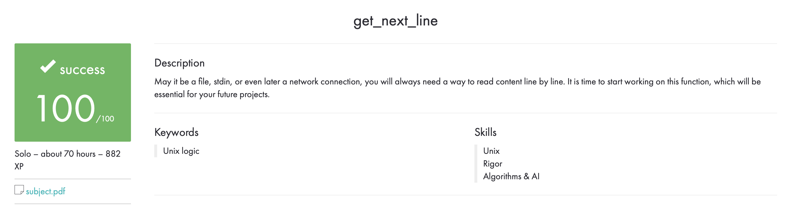

# Get Next Line (GNL)

## Project Overview

The goal of this project is to create a function that reads a file line by line and returns that line to the caller. The function should be able to manage multiple file descriptors simultaneously.



## How to Use

1. Clone the repository
2. Navigate to the repository directory
3. Run `make` command to compile the `get_next_line.c` file
4. Include the `get_next_line.h` header file in your project
5. Call the `get_next_line` function to read a line from a file

## Function Signature

```
int get_next_line(int fd, char **line);

```

## Parameters

- `fd`: The file descriptor of the file to read
- `line`: A pointer to a character string that will be used to store the line read from the file

## Return Value

The function returns:

- `1` if a line has been read
- `0` if the end of file has been reached
- `1` if an error occurred

## Notes

- The function allocates memory for the string pointed to by `line`. It is the responsibility of the caller to free this memory.
- The function manages multiple file descriptors simultaneously using a static variable. This means that the function is not thread safe.
- The maximum line length that can be read is defined by the `BUFFER_SIZE` macro, which can be set at compile time.

## Example Usage

```
#include "get_next_line.h"
#include <fcntl.h>

int main()
{
    int fd;
    char *line;
    int ret;

    fd = open("file.txt", O_RDONLY);
    if (fd == -1)
        return (1);
    ret = get_next_line(fd, &line);
    while (ret > 0)
    {
        // Do something with line
        free(line);
        ret = get_next_line(fd, &line);
    }
    if (ret == -1)
        return (1);
    return (0);
}

```
